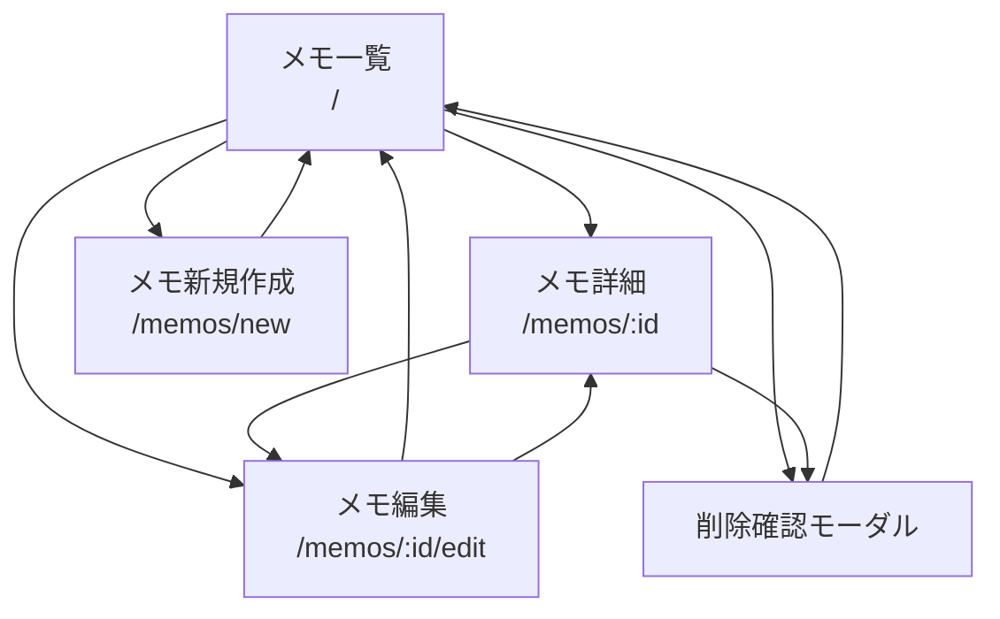

# 画面遷移図・情報設計

## 1. 画面遷移図



### 画面遷移の詳細

| 起点画面         | アクション                           | 遷移先画面           | 備考                                               |
| ---------------- | ------------------------------------ | -------------------- | -------------------------------------------------- |
| メモ一覧         | メモカードのタイトル/内容をクリック  | メモ詳細             | `:id`にメモIDを指定                                |
| メモ一覧         | メモカードの編集ボタンをクリック     | メモ編集             | メモ詳細を経由せず直接編集ページへ                 |
| メモ一覧         | メモカードの削除ボタンをクリック     | 削除確認モーダル表示 | メモ一覧上でモーダル表示                           |
| メモ一覧         | 新規作成ボタンをクリック             | メモ新規作成         | -                                                  |
| メモ詳細         | 編集ボタンをクリック                 | メモ編集             | -                                                  |
| メモ詳細         | 削除ボタンをクリック                 | 削除確認モーダル表示 | メモ詳細上でモーダル表示                           |
| メモ詳細         | 戻るボタンをクリック                 | メモ一覧             | -                                                  |
| メモ新規作成     | 保存ボタンをクリック                 | メモ一覧             | POST成功時                                         |
| メモ新規作成     | キャンセルボタンをクリック           | メモ一覧             | -                                                  |
| メモ編集         | 保存ボタンをクリック（詳細から遷移） | メモ詳細             | PUT成功時、元のメモ詳細へ戻る                      |
| メモ編集         | 保存ボタンをクリック（一覧から遷移） | メモ一覧             | PUT成功時、メモ一覧へ戻る                          |
| メモ編集         | キャンセルボタンをクリック           | 前の画面             | 詳細から来た場合は詳細へ、一覧から来た場合は一覧へ |
| 削除確認モーダル | 削除ボタンをクリック                 | メモ一覧             | DELETE成功時、モーダルを閉じて遷移                 |
| 削除確認モーダル | キャンセルボタンをクリック           | -                    | モーダルを閉じる（画面遷移なし）                   |

---

## 2. 各画面の情報設計

### 2.1 メモ一覧ページ (`/`)

#### 目的

- すべてのメモを一覧表示し、閲覧・管理の起点とする

#### 表示要素

- **ヘッダー**
  - ページタイトル: "メモ一覧"
  - メモの総件数表示
  - 新規作成ボタン
- **メモリスト**
  - メモカード（各メモごと）
    - メモタイトル (`title`)
    - メモ内容のプレビュー (`content` の先頭100文字程度)
    - 作成日時 (`created_at`)
    - 編集ボタン（アイコンまたはテキスト）
    - 削除ボタン（アイコンまたはテキスト）

#### 操作

- メモカードのタイトル/内容エリアをクリック: メモ詳細ページへ遷移
- メモカード内の編集ボタンをクリック: メモ編集ページへ直接遷移
- メモカード内の削除ボタンをクリック: 削除確認モーダルを表示
- 新規作成ボタン: メモ新規作成ページへ遷移

#### API連携

- `GET /memos` で全メモを取得

#### 状態管理

- メモリストの配列 (`Memo[]`)
- ローディング状態
- エラー状態
- 削除確認モーダルの開閉状態
- 削除対象のメモID

---

### 2.2 メモ詳細ページ (`/memos/:id`)

#### 目的

- 特定のメモの全内容を表示し、編集・削除の起点とする

#### 表示要素

- **ヘッダー**
  - 戻るボタン（メモ一覧へ）
  - 編集ボタン
  - 削除ボタン
- **メモコンテンツ**
  - メモタイトル (`title`)
  - メモ内容 (`content`)
  - 作成日時 (`created_at`)

#### 操作

- 戻るボタン: メモ一覧ページへ遷移
- 編集ボタン: メモ編集ページへ遷移
- 削除ボタン: 削除確認モーダルを表示

#### API連携

- `GET /memos/:id` で特定メモを取得

#### 状態管理

- 表示中のメモオブジェクト (`Memo`)
- ローディング状態
- エラー状態（404含む）
- モーダルの開閉状態

---

### 2.3 メモ新規作成ページ (`/memos/new`)

#### 目的

- 新しいメモを作成する

#### 表示要素

- **ヘッダー**
  - ページタイトル: "新規メモ作成"
  - キャンセルボタン
- **入力フォーム**
  - タイトル入力欄 (`title`)
    - 必須項目
    - プレースホルダー: "タイトルを入力"
    - 最大255文字
  - 内容入力欄 (`content`)
    - 任意項目
    - プレースホルダー: "内容を入力"
    - テキストエリア（複数行）
- **フッター**
  - 保存ボタン
  - キャンセルボタン

#### 操作

- 保存ボタン: バリデーション後、API経由でメモを作成し、成功時にメモ一覧へ遷移
- キャンセルボタン: 入力内容を破棄してメモ一覧へ遷移

#### API連携

- `POST /memos` で新規メモを作成

#### バリデーション

- タイトルが空でないこと
- タイトルが255文字以内であること

#### 状態管理

- フォーム入力値 (`title`, `content`)
- バリデーションエラー
- 送信中状態
- APIエラー状態

---

### 2.4 メモ編集ページ (`/memos/:id/edit`)

#### 目的

- 既存のメモを編集する

#### 表示要素

- **ヘッダー**
  - ページタイトル: "メモ編集"
  - キャンセルボタン
- **入力フォーム**
  - タイトル入力欄 (`title`)
    - 必須項目
    - 現在の値で初期化
    - 最大255文字
  - 内容入力欄 (`content`)
    - 任意項目
    - 現在の値で初期化
    - テキストエリア（複数行）
- **フッター**
  - 保存ボタン
  - キャンセルボタン

#### 操作

- 保存ボタン: バリデーション後、API経由でメモを更新し、成功時に遷移元の画面へ遷移
  - メモ詳細から来た場合: メモ詳細へ戻る
  - メモ一覧から来た場合: メモ一覧へ戻る
- キャンセルボタン: 編集内容を破棄して遷移元の画面へ遷移
  - メモ詳細から来た場合: メモ詳細へ戻る
  - メモ一覧から来た場合: メモ一覧へ戻る

#### API連携

- `GET /memos/:id` で編集対象のメモを取得（初期値として）
- `PUT /memos/:id` でメモを更新

#### バリデーション

- タイトルが空でないこと
- タイトルが255文字以内であること

#### 状態管理

- フォーム入力値 (`title`, `content`)
- 元のメモデータ
- バリデーションエラー
- 送信中状態
- APIエラー状態
- 遷移元の情報（一覧 or 詳細）

---

### 2.5 削除確認モーダル

#### 目的

- メモ削除の誤操作を防ぐための確認ダイアログ

#### 表示要素

- **モーダルヘッダー**
  - タイトル: "メモを削除しますか？"
- **モーダルボディ**
  - 確認メッセージ: "この操作は取り消せません。"
  - 削除対象のメモタイトルを表示
- **モーダルフッター**
  - キャンセルボタン（デフォルトフォーカス）
  - 削除ボタン（危険色: 赤系）

#### 操作

- キャンセルボタン: モーダルを閉じる（画面遷移なし）
  - メモ一覧から開いた場合: メモ一覧に留まる
  - メモ詳細から開いた場合: メモ詳細に留まる
- 削除ボタン: API経由でメモを削除し、成功時にモーダルを閉じてメモ一覧へ遷移
  - メモ一覧から削除した場合: メモ一覧を再取得して更新
  - メモ詳細から削除した場合: メモ一覧へ遷移

#### API連携

- `DELETE /memos/:id` でメモを削除

#### 状態管理

- 削除処理中状態
- APIエラー状態
- 削除対象のメモID

---

## 3. データモデル

### Memo オブジェクト

```typescript
interface Memo {
  id: number;
  title: string;
  content: string;
  created_at: string; // ISO 8601形式の日時文字列
}
```

---

## 4. URL設計

| URL               | 説明               |
| ----------------- | ------------------ |
| `/`               | メモ一覧ページ     |
| `/memos/new`      | メモ新規作成ページ |
| `/memos/:id`      | メモ詳細ページ     |
| `/memos/:id/edit` | メモ編集ページ     |

注: ルーティングは React Router を使用

---

## 5. エラーハンドリング

### 共通エラー処理

- API通信エラー時は、ユーザーにわかりやすいエラーメッセージを表示
- ネットワークエラー、タイムアウト、500エラーなどはトーストやアラートで通知

### 画面別エラー処理

- **メモ一覧**: 取得失敗時は空リストとエラーメッセージを表示
- **メモ詳細**: 404エラー時は「メモが見つかりません」と表示し、一覧へ戻るリンクを提示
- **メモ編集/新規作成**: バリデーションエラーは各入力欄にインラインで表示
- **削除**: 失敗時はモーダル内にエラーメッセージを表示し、再試行可能にする

---

## 6. UI/UXの考慮事項

### レスポンシブデザイン

- スマートフォン、タブレット、デスクトップで適切に表示
- メモ一覧はカード型レイアウトで、画面幅に応じてグリッド数を調整

### ローディング状態

- API通信中はスピナーやスケルトンスクリーンを表示
- ボタンの二重送信防止（送信中は無効化）

### アクセシビリティ

- セマンティックなHTML要素を使用
- キーボード操作に対応
- 適切なARIA属性を設定

### パフォーマンス

- メモ一覧は件数が多い場合、ページネーションまたは仮想スクロールを検討
- 画像の遅延読み込み（将来的に画像機能を追加する場合）

### メモカードの操作性

- メモカード上のボタン（編集・削除）とカード本体のクリック領域を明確に区別
- ボタンのクリック時はイベント伝播を停止し、詳細ページへの遷移を防ぐ
- ホバー時に視覚的フィードバックを提供（カーソル変更、背景色変更など）
- モバイルではタップ領域を十分に確保（最低44x44px推奨）

---

## 7. 今後の拡張性

### 検討事項

- **検索機能**: メモタイトル・内容での検索
- **タグ・カテゴリ機能**: メモの分類
- **並び替え機能**: 作成日時、更新日時、タイトル順など
- **マークダウン対応**: リッチなメモ作成
- **認証機能**: ユーザーごとのメモ管理
- **下書き保存**: LocalStorageを活用した一時保存

---
